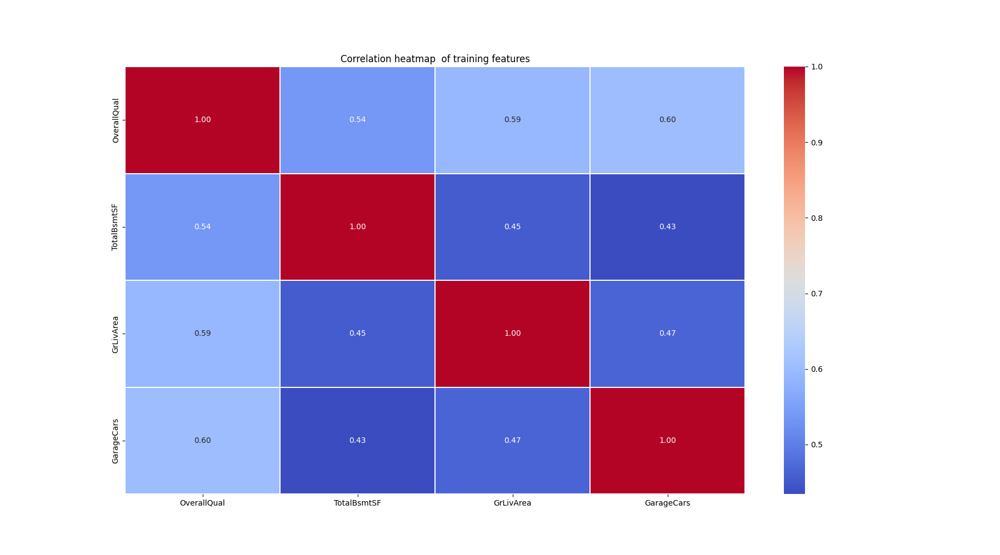
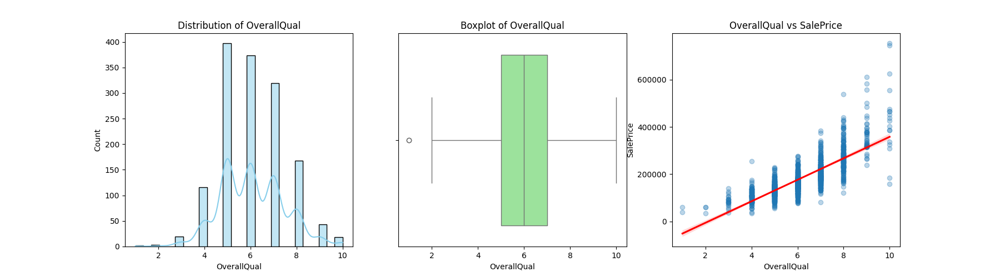
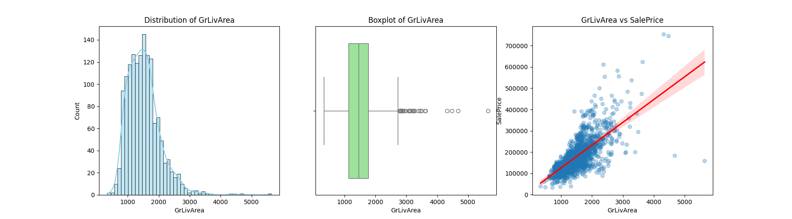
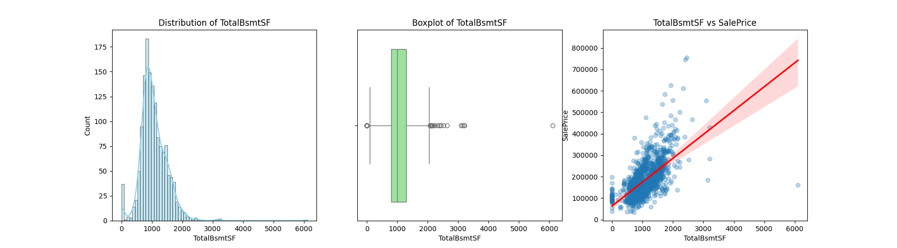
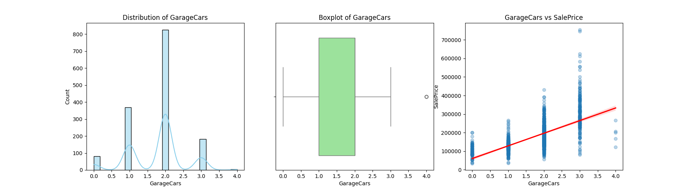

# Ames Housing: Price Prediction Model

This project builds a regression model to estimate house prices in Ames, Iowa using key property features. The focus is on simplicity, interpretability, and predictive performance.

---

## Project Workflow

### 1. Feature Selection
From a dataset with 80+ variables, key features were selected to reduce complexity and improve model stability.

- **Correlation filtering:** Selected features with strong correlation (|r| ≥ 0.6) with **SalePrice**
- **Multicollinearity handling:** Removed overlapping features to avoid redundancy  
  - Dropped **GarageArea** in favor of **GarageCars**  
  - Dropped **1stFlrSF** in favor of **TotalBsmtSF**

**Final feature set:**
- OverallQual  
- TotalBsmtSF  
- GrLivArea  
- GarageCars  

---

## Data Visualization

All visualizations are stored in the `visualizations/` folder.  
Each feature plot includes a histogram, scatter plot, and boxplot combined in one figure.

---

### Correlation Heatmap

---

### Overall Quality (OverallQual)

---

### Living Area (GrLivArea)

---

### Basement Area (TotalBsmtSF)

---

### Garage Capacity (GarageCars)

---

## Model Development

A **Multiple Linear Regression** model was trained to predict house prices.

- Train/Test split: 80% / 20%  
- Focus: interpretability and baseline performance  

---

## Model Evaluation

| Metric | Value |
|------|------|
| R² Score | 0.765 |
| Mean Absolute Error (MAE) | $23,571 |
| Root Mean Squared Error (RMSE) | $31,310 |
| Median Absolute Error | $20,001 |

---

## Key Findings

- Model explains ~76% of price variance  
- Small gap between training and testing performance → good generalization  
- Higher RMSE indicates sensitivity to expensive outliers  
- Better performance on typical homes than luxury properties  

---

